# Roadmap — JAC

> **Status:** Living · **Last revised:** 2026-05-03 · **Type:** component plan, in dependency order

JAC is built component by component, not slice by slice. Each entry below is a self-contained module with a stable ID (`C0`..`Cn`). Order reflects **dependency**, not calendar — `Cn+1` assumes `Cn` is in place.

## How to read this

- **IDs are stable.** Once a component has an ID, that ID never moves. New components get appended; if order has to change, dependencies are updated and we live with non-monotonic IDs.
- **Order is dependency-driven.** A component cannot ship before its prerequisites. Within a layer, ordering reflects what unblocks the most downstream work.
- **Checkpoints, not gates.** Some IDs are tagged as **acceptance checkpoints** (e.g. C11 = Notes CLI benchmark). They mark moments where end-to-end behaviour can be validated. They do not block thinking, designing, or brainstorming about anything later in the list.
- **Brainstorming is welcome at every layer.** A `lab/brainstorm/` note that talks about C20 is not "premature" — it just sits ahead of the current build front. Promote it to a Draft contract whenever the design is clear enough.
- **One component, one entry.** If a component grows into something with multiple shippable sub-pieces, split it (`C13a`, `C13b`) rather than redefining `C13`.

## System overview

Components grouped by the layer they live in. This is the target shape, not what's shipped today — see the **Status** field on each entry below for the current state.

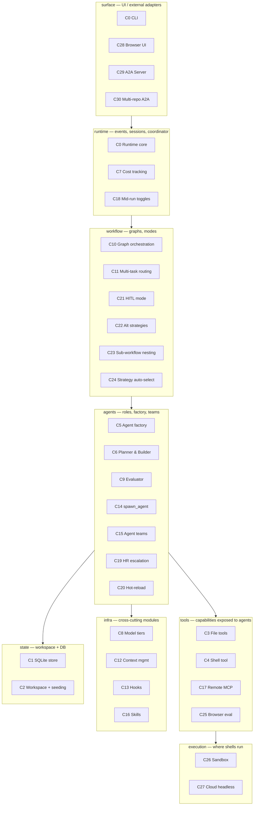

## Acceptance checkpoints

| Checkpoint | Reached after | What it proves |
|---|---|---|
| **Persistence checkpoint** | C2 | Sessions resume; workspace files seed into the DB. |
| **Single-task autonomy** | C9 | A planner+builder+evaluator+retry loop runs one task end-to-end. |
| **Notes CLI v0 benchmark** | C11 | Full feature-by-feature cycle on `docs/reference/V0_BENCHMARK.md`. Cost target: <$15. |
| **Multi-agent autonomy** | C15 | Master/Minion spawning with deterministic post-processing via hooks. |
| **Multi-strategy harness** | C22 | The same prompt produces measurably different runs under POC-swarm vs feature-by-feature. |
| **External surfaces** | C29 | Browser UI and A2A server consume the same event contract as the CLI. |

---

## Components

### C0 — CLI/Runtime Foundation

**Layer:** surface + runtime
**Status:** shipped (2026-04-27)
**Depends on:** —
**Brainstorm/contract:** [`CLI_DESIGN.md`](contracts/CLI_DESIGN.md), [`EVENT_CONTRACT.md`](contracts/EVENT_CONTRACT.md)

The presentation adapter and UI-agnostic runtime boundary. Click entrypoint, prompt_toolkit chat input, Rich rendering, typed events, approvals, questions, session state, `RunCoordinator`. Wraps a single Pydantic AI agent today; replaced internally by later components without changing the CLI/event contract.

**Ships:**
- `harness "prompt"` and `harness chat` entrypoints
- prompt_toolkit input with `@`-file references and `!`-shell shortcuts
- Rich renderer subscribed to runtime events
- `runtime/` package: events, approvals, questions, session, coordinator
- Tests covering CLI entrypoints, parser, renderer, runtime contracts, config, shell helpers

**Evaluation:**
- `uv run jac --help`, `uv run jac "say hello"`, `uv run jac chat` smoke
- `just test` green

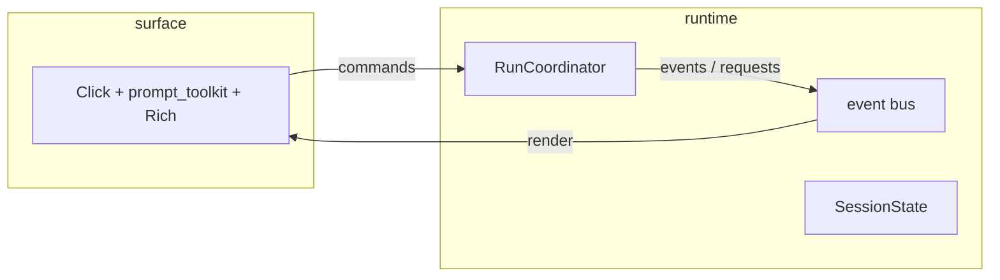

---

### C1 — Persistent State Store (SQLite)

**Layer:** state
**Status:** shipped (2026-05-03)
**Depends on:** C0
**Brainstorm/contract:** [`STATE_SCHEMA.md`](contracts/STATE_SCHEMA.md)

Move session/message state from in-memory dicts into a SQLite file. Establishes the `state/` package and the migration discipline. Active tables at this point: `runs`, `messages`. Other tables in `STATE_SCHEMA.md` are reserved — defined now so the schema direction is locked, populated as later components arrive.

**Ships:**
- `state/` package wrapping a SQLite file with a migration runner
- `runs` and `messages` rows persisted by `RunCoordinator`
- `harness resume <run-id>` rehydrates a prior session
- `/context` reads from the DB, not just in-memory attachments

**Evaluation:**
- Start a session, exit, `resume`; chat history visible
- `state.db` exists on disk; schema version row matches `STATE_SCHEMA.md`

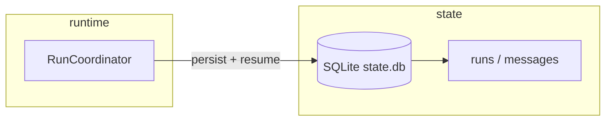

---

### C2 — Workspace Layout & File→DB Seeding

**Layer:** state
**Status:** planned
**Depends on:** C1
**Brainstorm/contract:** [`WORKSPACE.md`](contracts/WORKSPACE.md)

Anchors JAC to a project workspace. Adds `~/.jac/` for user globals and `<repo>/.agents/` for project state, with dotenv onboarding, `AGENTS.md` instruction files, and no-project fallback. A deterministic seeding pass walks both scopes on harness boot and upserts skills/MCP/agent rows so they're visible to later components.

**Ships:**
- Project discovery (upward walk for `.agents/` or `AGENTS.md`)
- Layered settings, dotenv, and instruction resolution
- `jac init`, `jac init --global`, and `jac doctor` onboarding/diagnostic commands
- Seeding node: file → `mcp_servers` / `skills` / `agent_configs` upsert
- Source metadata for seeded `skills` and `mcp_servers`

**Evaluation:**
- Add `<repo>/.agents/skills/foo.md` → row appears in `skills`
- Delete the file, reboot → row garbage-collected (no open run referencing it)
- Installed `jac` launched outside this checkout reads `~/.jac/.env` and reports missing credentials clearly

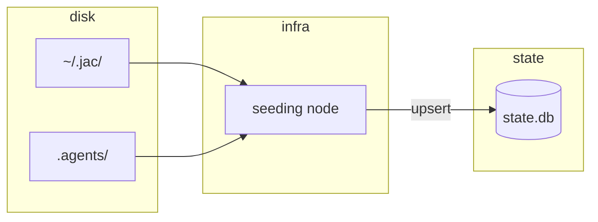

---

### C3 — File Tools with Approval

**Layer:** tools
**Status:** shipped (2026-05-03)
**Depends on:** C0
**Brainstorm/contract:** [`TOOLS_CONTRACT.md`](contracts/TOOLS_CONTRACT.md)

First agent-facing tool group: `read_file`, `write_file`, `edit_file`. Establishes the `ToolResult` / `ToolApprovalMeta` pattern. Writes show a Rich diff before approval; approval responses flow back as structured decisions.

**Ships:**
- `tools/types.py`: `ToolResult`, `ToolStatus`, `RiskLevel`, `ToolApprovalMeta`
- `tools/filesystem.py`: read/write/edit + list/search/grep
- `TOOL_REGISTRY` entries for `filesystem` and `filesystem:read`
- Diff preview wired to `FileEditPreviewed` event

**Evaluation:**
- Agent asked to create a file → diff renders, approval prompt fires, file lands
- Edit a file → diff shows, edit applies on approve

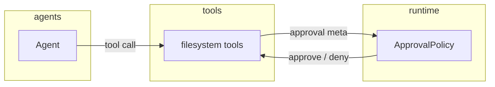

---

### C4 — Shell Tool with Approval

**Layer:** tools
**Status:** shipped (2026-05-03)
**Depends on:** C3
**Brainstorm/contract:** [`TOOLS_CONTRACT.md`](contracts/TOOLS_CONTRACT.md)

Agent shell execution sharing the same executor that powers user `!` shortcuts. HIGH-risk approvals by default. Output truncated head/tail to fit context. Background-process pattern (`run_shell_background`, `read_process_output`, `list_processes`) included from day one.

**Ships:**
- `tools/shell.py`: `run_shell`, `run_shell_background`, `read_process_output`, `list_processes`
- `TOOL_REGISTRY["shell"]`
- Shared logging/rendering with user `!` commands

**Evaluation:**
- Agent runs `ls` → approval prompt, output rendered
- Long output → truncated head+tail with byte-count warning

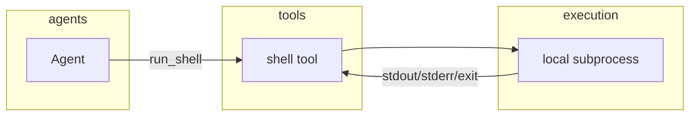

---

### C5 — Agent Factory & Config Loader

**Layer:** agents
**Status:** planned
**Depends on:** C1, C2, C3, C4
**Brainstorm/contract:** [`MCP_INTEGRATION.md`](contracts/MCP_INTEGRATION.md)

The single `Agent(...)` construction site. Reads `agent_configs` and `run_mcp_servers` / `run_skills`, resolves `allowed_tools`, composes the system prompt with skills, instantiates a Pydantic AI `Agent`. Nothing else in the codebase calls `Agent(...)` directly. This is the seam every later agent-shaped component plugs into.

**Ships:**
- `agents/base.py`: `config_loader` factory
- Tier → model mapping (`TIER_DEFAULTS`)
- `allowed_tools` resolution: local registry + MCP servers (registered, none active yet)
- Tests: factory builds agents from DB rows; tool/toolset wiring verified

**Evaluation:**
- Insert an `agent_configs` row, build agent, run a no-op prompt
- Switch `allowed_tools`, rebuild, verify the agent's tools change

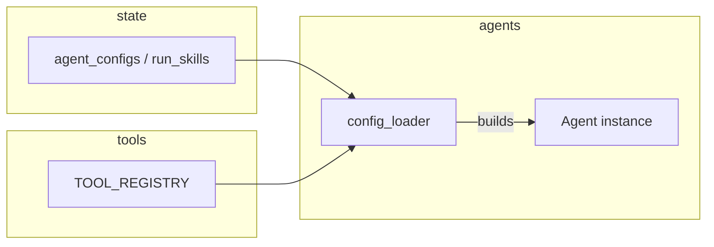

---

### C6 — Planner & Builder Agents

**Layer:** agents
**Status:** planned
**Depends on:** C5
**Brainstorm/contract:** [`IDEA.md`](reference/IDEA.md) §5

Two roles wired through the factory: a Planner that returns a small structured task plan, and a Builder that executes one planned task using the file/shell tools. No graph yet — Pydantic AI agent delegation is enough to prove the role split. End-to-end: a small task (e.g. fibonacci script) runs autonomously.

**Ships:**
- Seed `agent_configs` rows for `planner` and `builder`
- Planner returns a typed plan (Pydantic structured output)
- Builder executes one task through `Agent.iter()` with tools

**Evaluation:**
- "Write a Python script that prints fibonacci(10)" → plan + script + output
- Plan persisted to `tasks` table; build attempt persisted to `attempts`

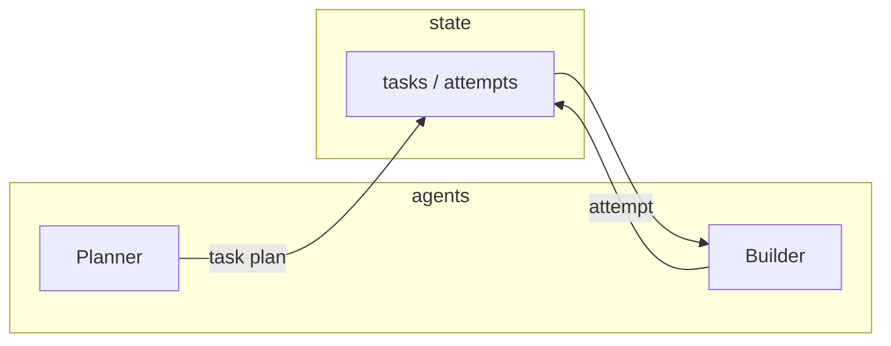

---

### C7 — Cost Tracking & `/cost`

**Layer:** runtime
**Status:** planned
**Depends on:** C6
**Brainstorm/contract:** [`STATE_SCHEMA.md`](contracts/STATE_SCHEMA.md) (`attempts`)

Per-call model, token, duration, and cost records captured into `attempts` (with `call_type='agent'` or `'direct_llm'`). `CostUpdated` events emitted at run end and on model changes. `/cost` slash command renders a useful run/session breakdown.

**Ships:**
- Cost-tracking wrapper around model calls
- Structured `CostUpdated` event (replacing the summary string)
- `/cost` slash command + Rich panel renderer

**Evaluation:**
- Run a small task; `/cost` shows tokens, cost per role, total
- `attempts` rows match the rendered totals

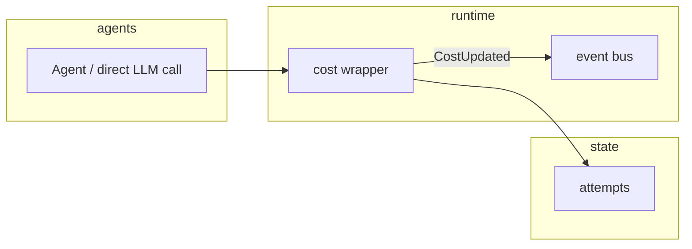

---

### C8 — Model Tier Routing

**Layer:** infra
**Status:** planned
**Depends on:** C5, C7
**Brainstorm/contract:** [`IDEA.md`](reference/IDEA.md) §2 (Model Buckets)

Provider-agnostic tier map (Scout / Worker / Architect) wired into `config_loader`. At least two providers represented. `/model` and `/tier` slash commands update session config safely. Planner defaults to Architect, Builder to Worker, at least one read-only node to Scout.

**Ships:**
- `TIER_DEFAULTS` covering 2+ providers
- `/model <id>` and `/tier <scout|worker|architect>` commands
- `model_override` honoured on `agent_configs`
- `SessionConfigChanged` events on tier/model changes

**Evaluation:**
- Switch tier mid-session; next turn uses new model (visible in `attempts`)
- `/cost` shows ≥2 tiers exercised in a single run

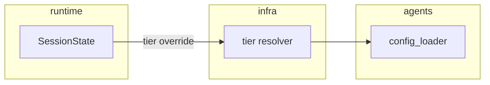

---

### C9 — Evaluation & Retry Loop

**Layer:** workflow (pre-graph)
**Status:** planned
**Depends on:** C6, C8
**Brainstorm/contract:** [`EVENT_CONTRACT.md`](contracts/EVENT_CONTRACT.md) (Evaluation events)

An evaluator role grades pass/fail against acceptance criteria; one retry loop on failure. Surfaces `EvaluationStarted` / `EvaluationCompleted` events. After this component, a single task can run end-to-end autonomously: plan → build → evaluate → retry once.

**Ships:**
- `evaluator` agent config + system prompt
- Retry loop wrapping build → evaluate
- `attempts.eval_score` / `eval_passed` / `eval_feedback` populated
- `pydantic_evals` integration for structured scoring

**Evaluation:**
- Ambiguous task: first attempt fails eval, retries, second passes
- **Acceptance checkpoint: single-task autonomy.**

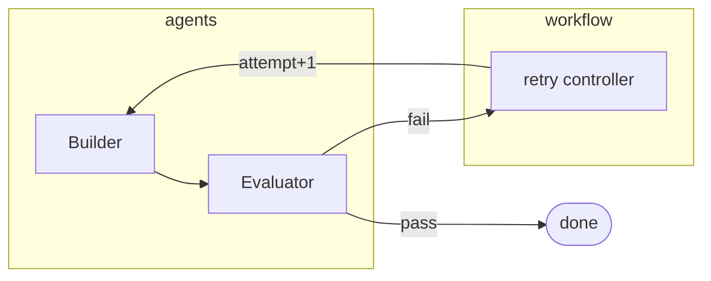

---

### C10 — Graph Orchestration (pydantic_graph)

**Layer:** workflow
**Status:** planned
**Depends on:** C9
**Brainstorm/contract:** [`PHILOSOPHY.md`](reference/PHILOSOPHY.md), [`IDEA.md`](reference/IDEA.md) §5

Behaviour-preserving refactor onto `pydantic_graph`. A `nodes/` package with a uniform `BaseNode` (state-in / state-out). A `workflows/feature_by_feature.py` wires plan / build / evaluate as graph nodes. `RunCoordinator` delegates to the graph runner without changing the event contract.

**Ships:**
- `nodes/` with `BaseNode` interface and the existing nodes wrapped
- `workflows/feature_by_feature.py`
- `RunCoordinator` graph-driven, single-task only

**Evaluation:**
- Same task as C9 produces identical events and outputs
- Graph traversal visible in events (`NodeStarted` carries `run_id`/`task_id`)

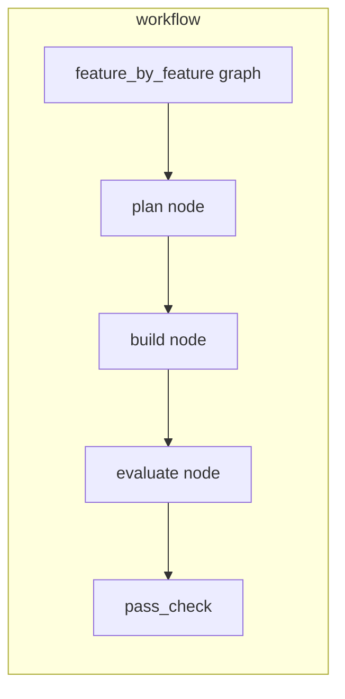

---

### C11 — Multi-Task Routing & Notes CLI Checkpoint

**Layer:** workflow
**Status:** planned
**Depends on:** C10, C2
**Brainstorm/contract:** [`V0_BENCHMARK.md`](reference/V0_BENCHMARK.md)

Adds `task_router` (reads pending tasks from the DB) and `context_loader` (builds scoped context per agent role). A multi-task plan now executes end-to-end. **Acceptance checkpoint:** the Notes CLI benchmark in `V0_BENCHMARK.md` runs autonomously, hits ≥5/7 features, and stays under $15.

**Ships:**
- `task_router` and `context_loader` nodes
- Multi-task `feature_by_feature` workflow
- Notes CLI benchmark harness (run + score reporting)

**Evaluation:**
- **Acceptance checkpoint: Notes CLI v0 benchmark.** All commands exit 0, ≥5/7 features pass, total cost <$15, ≥2 tiers exercised.
- Run trace shows: plan → router → loader → build → evaluate → router → … → done

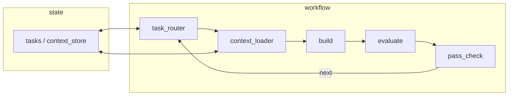

---

### C12 — Context Management Module

**Layer:** infra
**Status:** planned
**Depends on:** C11
**Brainstorm/contract:** [`lab/brainstorm/2026-05-02-context-management-module.md`](../lab/brainstorm/2026-05-02-context-management-module.md)

A `ContextManager` interface behind Pydantic AI `history_processors`, called per-role. Supports token/message-count triggers and head/tail/segment-rollup strategies. Direct-LLM summarisation routed through the cost tracker (`call_type='direct_llm'`). Lands after the Notes CLI checkpoint because that benchmark is too small to trigger compaction.

**Ships:**
- `ContextManager` module + `history_processor` adapters
- Per-role config (`compact_at_tokens`, `strategy`, `summary_tier`)
- `ContextCompacted` event + `attempts` audit trail

**Evaluation:**
- Synthetic long conversation triggers compaction; task progress preserved
- Summarisation cost recorded; total tokens drop on the next turn

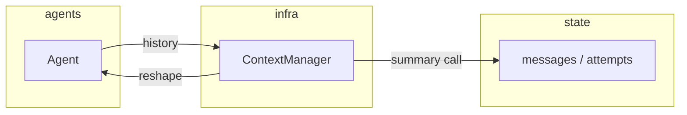

---

### C13 — Hooks/Callbacks Module

**Layer:** infra
**Status:** planned
**Depends on:** C10
**Brainstorm/contract:** [`lab/brainstorm/2026-05-02-hooks-and-callbacks-module.md`](../lab/brainstorm/2026-05-02-hooks-and-callbacks-module.md)

A `HookManager` with named lifecycle points (`pre_run`, `post_run`, `pre_model`, `post_model`, `post_tool` — `pre_tool` is already the approval system). Hooks run deterministic code (type checks, linters, telemetry), composing in registration order with a deny/retry signal. Conceptually separate from approvals.

**Ships:**
- `HookManager` with registration API
- Five lifecycle seams wired through `Agent.iter()`
- Built-in hooks (telemetry, audit) plus user-loadable hooks via `<repo>/.agents/hooks/`
- `HOOKS.md` contract drafted and promoted to Locked

**Evaluation:**
- Register a `post_run` hook that runs `uv run ty check`; failure triggers retry without LLM call
- Hook ordering is deterministic; deny short-circuits later hooks at the same seam

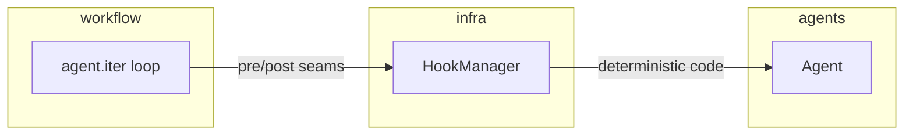

---

### C14 — Dynamic Agent Summoning (`spawn_agent` toolgroup)

**Layer:** agents + tools
**Status:** planned
**Depends on:** C5, C13
**Brainstorm/contract:** [`TOOLS_CONTRACT.md`](contracts/TOOLS_CONTRACT.md) §"Sub-Agent Toolgroup (C14)"

A new `agents` toolgroup whose only tool, `spawn_agent(role, task, context_scope, hooks=...)`, instantiates a child Pydantic AI agent through `config_loader`. Child gets a fresh message history (context isolation), optional hooks, and reports back as a structured `AgentResult`. Tracked in `attempts` like any other LLM call.

**Ships:**
- `tools/agents.py` with `spawn_agent`
- `TOOL_REGISTRY["agents"]`
- Hook attachment at spawn time
- `AgentSpawned` / `AgentReturned` events

**Evaluation:**
- Master agent spawns Minion to fix a bug; Minion result returns to Master
- `post_run` hook (`ty check`) runs; failure re-dispatches Minion deterministically

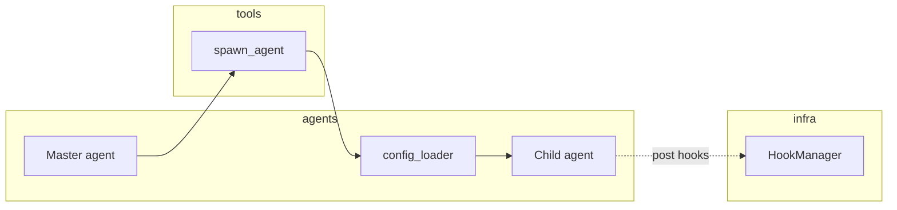

---

### C15 — Agent Teams & Inter-Agent Messaging

**Layer:** agents + state
**Status:** planned
**Depends on:** C14
**Brainstorm/contract:** [`STATE_SCHEMA.md`](contracts/STATE_SCHEMA.md) (`agent_instances`, `agent_teams`, `agent_messages`)

Activates the reserved tables. Multiple agent instances run within one `run_id` and coordinate via the `agent_messages` queue (bug reports, handoffs, broadcasts). Strategies: `parallel`, `sequential`, `mixed`. **Acceptance checkpoint:** multi-agent autonomy — a builder/tester pair runs concurrently, the tester posts a bug report, the builder picks it up.

**Ships:**
- `agent_instances` / `agent_teams` / `agent_messages` wired live
- Team strategy executor (parallel / sequential / mixed)
- Inter-agent message types: `bug_report`, `task_complete`, `handoff`, `question`, `info`, `review_request`

**Evaluation:**
- **Acceptance checkpoint: multi-agent autonomy.**
- Builder + Tester run on a 5-feature task; tester posts a bug → builder fixes → tester resumes
- All instance/message activity visible in DB and events

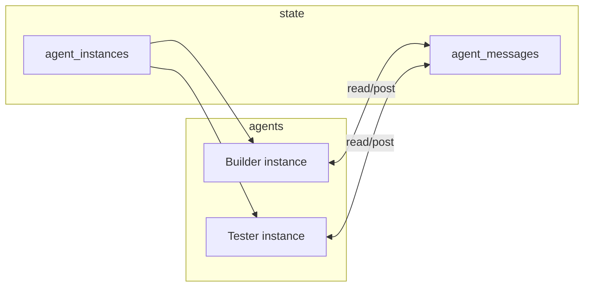

---

### C16 — Skills System (Dynamic Injection)

**Layer:** infra
**Status:** planned
**Depends on:** C5, C2
**Brainstorm/contract:** [`IDEA.md`](reference/IDEA.md) §3.6, [`MCP_INTEGRATION.md`](contracts/MCP_INTEGRATION.md) §Skills Injection

A `skill_injector` node looks up domain skills (per task classification) and prepends them to agent system prompts at instantiation time. Sourced from the `skills` table (seeded by C2). Examples: React conventions for frontend tasks, Terraform patterns for infra tasks.

**Ships:**
- `skill_injector` node
- Domain classification on task plan
- `run_skills` populated per task domain
- `/skills` slash command (read-only listing)

**Evaluation:**
- Same task with/without a relevant skill: output measurably more idiomatic with skill
- Audit shows which skills were active per attempt

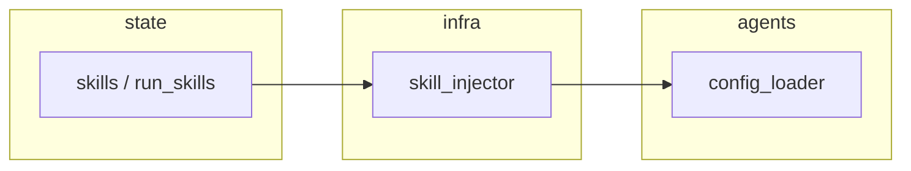

---

### C17 — Remote MCP Server Integration

**Layer:** tools
**Status:** planned
**Depends on:** C5
**Brainstorm/contract:** [`MCP_INTEGRATION.md`](contracts/MCP_INTEGRATION.md)

Wires the `mcp:<name>` half of `allowed_tools` resolution. Up to C16 the MCP infrastructure is registry-only; this component adds live transports (`stdio`, `http`, `sse`) and the `MCPServerConnected` / `Disconnected` lifecycle events. First real MCP server: Playwright (used by C25).

**Ships:**
- `MCPServerStdio`, `MCPServerStreamableHTTP`, `MCPServerSSE` wiring in `config_loader`
- `async with agent:` lifecycle owned by the agent run
- `MCPServerConnected` / `MCPServerDisconnected` events

**Evaluation:**
- Register a Playwright MCP row, reference `mcp:playwright` in `allowed_tools`, run an agent that calls a Playwright tool
- Transport disconnect surfaces as an event; agent retries gracefully

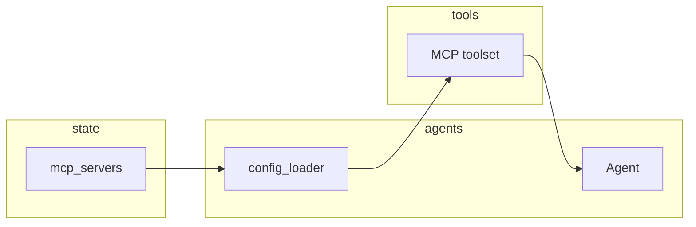

---

### C18 — Mid-Run Config Toggles

**Layer:** runtime
**Status:** planned
**Depends on:** C16, C17
**Brainstorm/contract:** [`EVENT_CONTRACT.md`](contracts/EVENT_CONTRACT.md), [`MCP_INTEGRATION.md`](contracts/MCP_INTEGRATION.md) §Mid-Run Toggle

`/disable mcp:<name>` and `/disable skill:<name>` (and their `/enable` siblings). Sets `enabled=0` on `run_mcp_servers` / `run_skills`, emits a toggle event, rebuilds the agent on the next turn. Deliberate user action only — never automatic.

**Ships:**
- `toggle_mcp` and `toggle_skill` commands
- `MCPServerToggled` / `SkillToggled` events
- Slash-command UI; rebuild path in `config_loader`

**Evaluation:**
- `/disable mcp:playwright` mid-conversation → next turn agent has no Playwright tool
- `/enable` restores it; message history preserved across both transitions

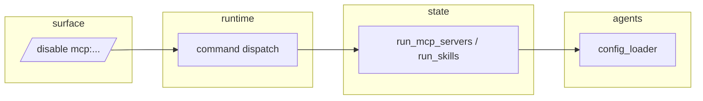

---

### C19 — Dynamic Model Escalation (HR agent)

**Layer:** agents
**Status:** planned
**Depends on:** C9, C15
**Brainstorm/contract:** [`IDEA.md`](reference/IDEA.md) §3.1

The deterministic `hr_escalation` node tracks per-task pass/fail counts per tier; after N failures, rewrites `agent_configs.tier` for that task and re-dispatches. Every escalation logged for the research dataset (`task_type → minimum tier`).

**Ships:**
- `hr_escalation` node + `TaskEscalated` event
- Per-task attempt counter in `tasks.attempt_count`
- Escalation audit: `task_type`, `from_tier`, `to_tier`, `reason`

**Evaluation:**
- Force-fail a Scout-tier task → escalates to Worker → succeeds
- Audit query returns the escalation row with full provenance

```mermaid
flowchart LR
  subgraph workflow[workflow]
    pc[pass_check]
  end
  subgraph agents[agents]
    hr[hr_escalation]
    fac[config_loader]
  end
  subgraph state[state]
    tk[tasks / agent_configs]
  end
  pc -->|N fails| hr --> tk
  tk --> fac
```

---

### C20 — Agent Config Hot-Reloading Mid-Run

**Layer:** agents
**Status:** planned
**Depends on:** C19
**Brainstorm/contract:** [`IDEA.md`](reference/IDEA.md) §3.3

Generalises the escalation rebuild path. Any change to `agent_configs` (slash command, hook, escalation, A/B experiment) takes effect on the next turn for that role. Message history is preserved; the tool block and system prompt may change. The cache-miss tradeoff is intentional and visible.

**Ships:**
- `config_loader` always rebuilds from DB at turn start (no per-run caching)
- `AgentConfigChanged` event
- Documented cache-miss semantics

**Evaluation:**
- Change `system_prompt` mid-run via the DB; next turn picks it up
- Cache-miss recorded in cost log on the rebuild turn

```mermaid
flowchart LR
  subgraph state[state]
    cfg[agent_configs]
  end
  subgraph agents[agents]
    fac[config_loader]
    a[Agent (turn N)]
    a2[Agent (turn N+1)]
  end
  cfg --> fac
  fac --> a
  cfg -->|mutated| fac
  fac --> a2
```

---

### C21 — HITL Mode

**Layer:** workflow
**Status:** planned
**Depends on:** C13
**Brainstorm/contract:** [`IDEA.md`](reference/IDEA.md) §3.4

A second top-level workflow composition that reuses every node in `feature_by_feature` and inserts `human_checkpoint` nodes at key decision points. Uses the existing question primitive in `runtime/questions.py`. Selected via `harness run --mode hitl` or `/mode hitl`.

**Ships:**
- `workflows/feature_by_feature_hitl.py`
- `human_checkpoint` node + `feedback_injector` node
- `--mode autopilot|hitl` flag and `/mode` slash command

**Evaluation:**
- Run Notes CLI under HITL: pauses at planning, waits for human input, integrates feedback
- Same run under autopilot: no pauses, identical output otherwise

```mermaid
flowchart LR
  subgraph workflow[workflow]
    pl[plan] --> hc[human_checkpoint] --> fi[feedback_injector] --> rt[task_router] --> bd[build] --> ev[evaluate]
  end
```

---

### C22 — Alternative Workflow Strategies

**Layer:** workflow
**Status:** planned
**Depends on:** C10, C13
**Brainstorm/contract:** [`IDEA.md`](reference/IDEA.md) §3.2

Add POC-then-swarm, TDD, agile/sprint, and spec-driven as separate workflow compositions over the shared node library. Strategy nodes (`sprint_planner`, `poc_builder`, `test_generator`, `swarm_dispatcher`, `retrospective`) added per workflow. **Acceptance checkpoint:** the same prompt produces measurably different runs under POC-swarm vs feature-by-feature.

**Ships:**
- `workflows/poc_swarm.py`, `workflows/tdd.py`, `workflows/agile.py`, `workflows/spec_driven.py`
- Strategy nodes registered alongside core nodes
- `harness run --strategy <name>` + `/strategy` command

**Evaluation:**
- **Acceptance checkpoint: multi-strategy harness.**
- Same Notes CLI prompt under each strategy; compare cost / quality / duration

```mermaid
flowchart LR
  subgraph workflow[workflow]
    fbyf[feature_by_feature]
    poc[poc_swarm]
    tdd[tdd]
    ag[agile]
    sp[spec_driven]
  end
  subgraph agents[agents]
    nodes[shared node library]
  end
  fbyf --> nodes
  poc --> nodes
  tdd --> nodes
  ag --> nodes
  sp --> nodes
```

---

### C23 — Sub-Workflow Nesting

**Layer:** workflow
**Status:** planned
**Depends on:** C22
**Brainstorm/contract:** [`IDEA.md`](reference/IDEA.md) §5

Workflows can invoke other workflows as sub-routines. Examples: feature-by-feature dispatching a TDD sub-workflow for a critical feature; POC-swarm using feature-by-feature as the swarm-worker strategy. Implemented via `pydantic_graph` graph composition + `run_subgraph` helper.

**Ships:**
- `run_subgraph(workflow_name, task_id)` node
- Sub-run lifecycle in events (`SubRunStarted` / `SubRunCompleted`)
- `tasks.parent_task_id` populated for sub-workflow tasks

**Evaluation:**
- Critical task inside Notes CLI gets routed through TDD sub-workflow
- Cost / token / scoring rolls up to the parent run

```mermaid
flowchart LR
  subgraph workflow[workflow]
    parent[parent workflow]
    sub[sub-workflow]
  end
  parent -->|run_subgraph| sub
  sub -->|result| parent
```

---

### C24 — Strategy Auto-Selection

**Layer:** workflow
**Status:** planned
**Depends on:** C22
**Brainstorm/contract:** [`IDEA.md`](reference/IDEA.md) §3.2

A `strategy_selector` node (deterministic or LLM-classified) chooses which workflow to run for a given prompt — simple apps → POC-swarm, complex apps → feature-by-feature, etc. Closes the loop on the research questions about strategy fit.

**Ships:**
- `strategy_selector` node
- Classification rubric (heuristic + LLM fallback)
- `/strategy auto|<name>` command

**Evaluation:**
- Diverse prompts produce diverse strategy choices
- Override (`--strategy <name>`) bypasses the selector cleanly

```mermaid
flowchart LR
  subgraph workflow[workflow]
    sel[strategy_selector]
    fbyf[feature_by_feature]
    poc[poc_swarm]
    tdd[tdd]
  end
  sel --> fbyf
  sel --> poc
  sel --> tdd
```

---

### C25 — Browser-Based Evaluation (Playwright)

**Layer:** tools
**Status:** planned
**Depends on:** C17
**Brainstorm/contract:** [`IDEA.md`](reference/IDEA.md) §4

The evaluator gains a Playwright MCP toolset for browser-driven acceptance tests on apps with a UI. CLI-shaped benchmarks (Notes CLI) keep their shell-based evaluation; web app benchmarks use Playwright. Same `evaluate` node, different toolset.

**Ships:**
- Playwright MCP server entry seeded into `~/.jac/mcp/`
- Evaluator config gains `mcp:playwright` in `allowed_tools` for web tasks
- Browser test artefacts (screenshots) attached to `attempts.eval_feedback`

**Evaluation:**
- A small web-app benchmark passes evaluator + Playwright checks
- Screenshots stored, retrievable from the run record

```mermaid
flowchart LR
  subgraph agents[agents]
    ev[Evaluator]
  end
  subgraph tools[tools]
    pw[Playwright MCP]
  end
  subgraph execution[execution]
    br[browser]
  end
  ev --> pw --> br
```

---

### C26 — Sandboxed/Container Shell Execution

**Layer:** execution
**Status:** planned
**Depends on:** C4
**Brainstorm/contract:** [`IDEA.md`](reference/IDEA.md) §2 (Execution: Local First)

Pluggable execution backend behind the shell tool. Default backend stays local; container backend (Docker / Podman) added without changing the agent code. Workspace bind-mount, network policy, env scrubbing live here.

**Ships:**
- `execution/` package with `LocalExecutor` and `ContainerExecutor`
- Backend selected via `settings.json` / `--executor` flag
- Tool-level approval semantics unchanged

**Evaluation:**
- Notes CLI benchmark runs identically under local vs container executor
- Container blocks network egress when policy says so

```mermaid
flowchart LR
  subgraph tools[tools]
    sh[shell tool]
  end
  subgraph execution[execution]
    sel[executor selector]
    loc[LocalExecutor]
    con[ContainerExecutor]
  end
  sh --> sel --> loc
  sel --> con
```

---

### C27 — Cloud Headless Execution

**Layer:** execution + surface
**Status:** planned
**Depends on:** C26
**Brainstorm/contract:** [`IDEA.md`](reference/IDEA.md) §2

Run JAC headlessly against a managed container backend so overnight benchmarks no longer pin a workstation. Reuses the same runtime + execution interface; differs only in the surface (no terminal, structured stdout/stderr) and the executor (remote container).

**Ships:**
- Headless surface (machine-readable event stream)
- Cloud executor adapter (container runtime API)
- `harness run --headless --remote` invocation path

**Evaluation:**
- Notes CLI benchmark scheduled remotely; result + cost report retrieved on completion
- Same event types as local run; consumers don't notice the difference

```mermaid
flowchart LR
  subgraph surface[surface]
    hl[headless adapter]
  end
  subgraph runtime[runtime]
    coord[RunCoordinator]
  end
  subgraph execution[execution]
    rem[remote executor]
  end
  hl --> coord --> rem
```

---

### C28 — Browser UI Adapter

**Layer:** surface
**Status:** planned
**Depends on:** C0 (event contract)
**Brainstorm/contract:** [`PHILOSOPHY.md`](reference/PHILOSOPHY.md), [`EVENT_CONTRACT.md`](contracts/EVENT_CONTRACT.md)

A browser UI subscribed to the same events the CLI consumes. No runtime changes — only a new adapter under `surfaces/browser/`. Implements approval and question handling so HITL works across the wire.

**Ships:**
- `surfaces/browser/` package (web server + websocket bridge)
- Renderers for all event types in `EVENT_CONTRACT.md`
- Approval and question response forwarded to `EventBus.resolve_*`

**Evaluation:**
- Same Notes CLI run viewable in CLI and browser concurrently
- Approving a tool call from the browser unblocks the runtime

```mermaid
flowchart LR
  subgraph surface[surface]
    cli[CLI]
    web[Browser UI]
  end
  subgraph runtime[runtime]
    bus[event bus]
  end
  bus --> cli
  bus --> web
  cli --> bus
  web --> bus
```

---

### C29 — A2A Server Adapter

**Layer:** surface
**Status:** planned
**Depends on:** C28, C15
**Brainstorm/contract:** [`PHILOSOPHY.md`](reference/PHILOSOPHY.md)

JAC exposes an A2A endpoint so other agents can dispatch tasks to it as if it were one of their own roles. Reuses the runtime event contract; the surface translates between A2A protocol messages and runtime events.

**Ships:**
- `surfaces/a2a/` adapter
- Authentication + capability discovery
- Run-as-peer mode: incoming task creates a `runs` row, returns result

**Evaluation:**
- Peer agent dispatches a Notes CLI task; receives result + cost
- Failure semantics covered (peer death, timeout)

```mermaid
flowchart LR
  subgraph surface[surface]
    a2a[A2A server]
  end
  subgraph runtime[runtime]
    coord[RunCoordinator]
  end
  peer[peer agent] --> a2a --> coord
  coord --> a2a --> peer
```

---

### C30 — Multi-Repo A2A Runs

**Layer:** surface + agents
**Status:** planned
**Depends on:** C29, C15
**Brainstorm/contract:** [`lab/brainstorm/2026-05-02-multi-repo-a2a-runs.md`](../lab/brainstorm/2026-05-02-multi-repo-a2a-runs.md)

Per-repo agents, each rooted in its own `<repo>/.agents/` workspace, communicating via A2A. A coordinator addresses peers by name and dispatches subtasks across the repo boundary. Tier routing per repo becomes natural: docs-repo agents skew Scout, infra-repo agents skew Architect.

**Ships:**
- Peer discovery (config or `~/.jac/peers.json`)
- Cross-repo super-run lifecycle (parent run links cross-repo runs)
- Cross-boundary failure semantics (retry / escalate / fail-fast)

**Evaluation:**
- Two-repo benchmark: app + infra. Coordinator dispatches infra task to infra-repo peer, app task to app-repo peer; both complete; super-run rolls up cost.

```mermaid
flowchart LR
  subgraph repoA[repo A]
    aA[A2A peer]
  end
  subgraph repoB[repo B]
    aB[A2A peer]
  end
  subgraph coord[coordinator]
    sup[super-run]
  end
  sup <--> aA
  sup <--> aB
```

---

## Notes

Worth remembering — decisions, dead ends, tricks that worked.

- CLI is an adapter over `runtime/`, not the orchestrator.
- Approvals and questions are separate primitives; do not reuse approval prompts for clarification questions.
- Future browser UI and A2A surfaces consume the runtime event/request contract, not CLI modules.
- Orchestration library locked: Pydantic AI throughout. `pydantic_graph` enters at C10.
- State store locked: SQLite. Schema in `docs/contracts/STATE_SCHEMA.md` — update that doc before touching DB code.
- Benchmark for the Notes CLI checkpoint: `docs/reference/V0_BENCHMARK.md`.
- HITL is its own workflow composition (C21), not a checkpoint inside the autopilot workflow.
- `agents/base.py` (config_loader) is the sole factory for live Pydantic AI agents — nothing else calls `Agent(...)` directly.

---

## Done

Move components here when shipped, with the date.

### C0 — CLI/Runtime Foundation (2026-04-27)

- [x] `docs/contracts/CLI_DESIGN.md` captures CLI philosophy, input grammar, events, approvals, questions, extension rules
- [x] Click entrypoint supports `harness "prompt"` and `harness chat`
- [x] prompt_toolkit chat input
- [x] Rich renderer subscribes to runtime events
- [x] Runtime has typed events, approvals, questions, session state, `RunCoordinator`
- [x] `@` file references become structured attachments
- [x] User `!` shell commands use a shared shell executor
- [x] Focused tests cover CLI entrypoints, parser, renderer, runtime contracts, config, shell helpers

---

### C3 — File Tools with Approval (2026-05-03)

- [x] `tools/types.py`: `ToolResult`, `ToolStatus`, `RiskLevel`, `ToolApprovalMeta`; all filesystem and shell result types
- [x] `tools/filesystem.py`: `read_file`, `write_file`, `edit_file`, `list_directory`, `search_files`, `grep_files` — each with `ToolApprovalMeta` attached
- [x] `TOOL_REGISTRY` entries for `filesystem` (full) and `filesystem:read` (read-only subset)
- [x] `FileEditResult.diff` carries a unified diff so the C5 approval middleware can emit `FileEditPreviewed` without recomputing
- [x] `FileEditPreviewed` / `FileEditApplied` event types defined; renderer subscribed
- [x] Tests: 28 cases across all 6 tools including approval metadata, error paths, and edge cases

---

### C4 — Shell Tool with Approval (2026-05-03)

- [x] `tools/shell.py`: `run_shell`, `run_shell_background`, `list_processes`, `read_process_output` — each with `ToolApprovalMeta` attached
- [x] `TOOL_REGISTRY["shell"]` (full) and `TOOL_REGISTRY["shell:read"]` (inspection only)
- [x] `ChatApp._handle_shell` emits `ShellCommandStarted` / `ShellCommandCompleted` around `run_shell` — shared rendering path for user `!` commands and future agent tool calls
- [x] `ShellCommandStarted` / `ShellCommandCompleted` event types defined; renderer subscribed
- [x] Tests: background process lifecycle (start, list, read output), approval metadata for all 4 functions

---

### C1 — Persistent State Store (SQLite) (2026-05-03)

- [x] `src/jac/state/` package with `StateStore`, `RunsRepo`, `MessagesRepo`
- [x] `001_initial.sql` migration creates all 12 tables from `STATE_SCHEMA.md` v1.0; `schema_meta` records the applied version
- [x] `aiosqlite` connection with `PRAGMA foreign_keys = ON`; idempotent `open_state_store(db_path)` runs pending migrations
- [x] `run_id` semantics changed: one run per harness invocation, generated on `SessionState`, persisted at first turn, tags every message
- [x] `RunCoordinator` accepts an optional `StateStore`; persists `runs` row and user/assistant `messages` rows; updates run status to `done`/`failed`
- [x] `resume_run(state, settings, run_id)` rebuilds a coordinator with prior message history fed into the next `agent.run(...)` call
- [x] `jac resume <run-id>` Click subcommand drops into the chat loop with restored context
- [x] `/context` reads run id, message count from the DB; cwd and attachments still shown
- [x] State DB lives at `Workspace.state_db_path` (project `.agents/state.db` or `~/.jac/runs/<cwd-hash>/state.db`) — wired through `discover_workspace`
- [x] Tests: 7 cases for the state package (migration, repos, idempotency, FK enforcement) + 5 integration cases (coordinator persistence, run-id stability across turns, resume hydration, missing-run error, no-state fallback) + 2 CLI cases for the `resume` command
- [x] Version bumped to 0.2.0 (intentional break in `run_id` semantics)
