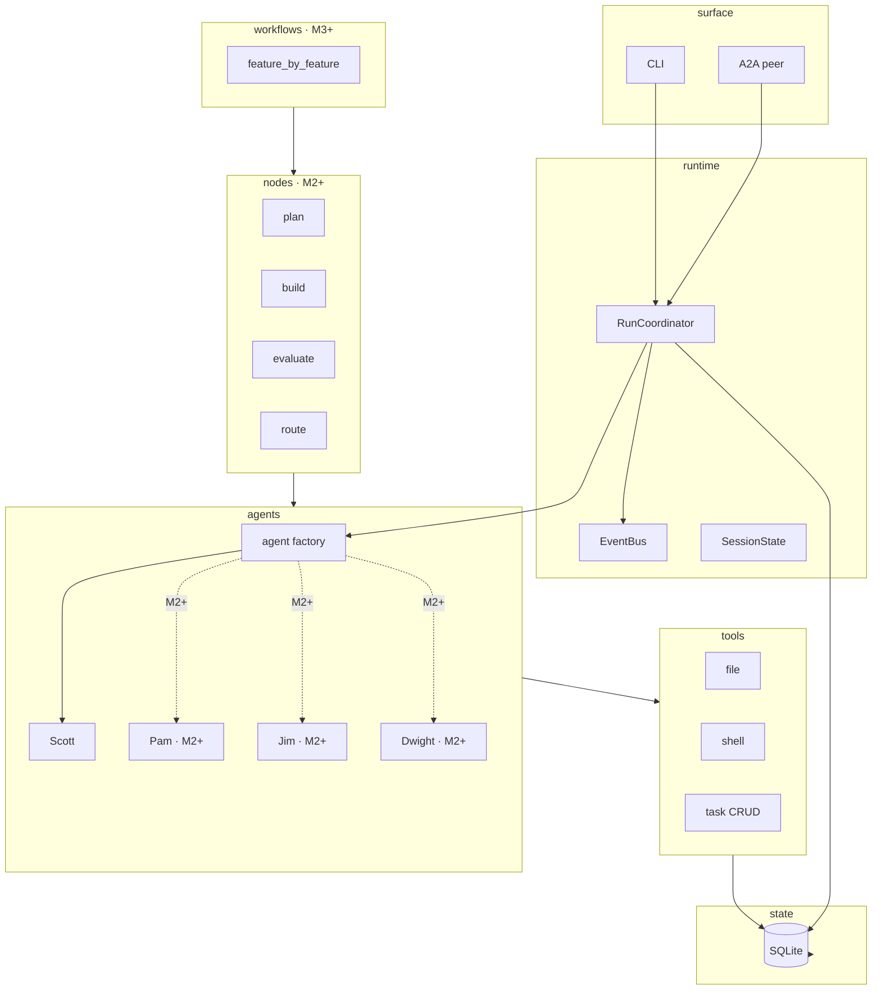

# Roadmap — JAC

> **Status:** Living · **Last revised:** 2026-05-18 · **Type:** Phase-1 milestones + Phase-2 evidence-gated catalog
>
> _2026-05-08: full reset. The 31-component plan is replaced by 5 milestones (M1–M5) for Phase 1 + an evidence-gated catalog for Phase 2. Source-of-truth brainstorm: [`lab/brainstorm/2026-05-08-jac-reset-from-scratch.md`](../lab/brainstorm/2026-05-08-jac-reset-from-scratch.md). C0–C8 preserved in the **Done** section as historical record._

JAC's Phase 1 is **5 milestones** that produce the deliverable: a comparison report on Notes CLI + a single-function bug-fix benchmark, evaluated against the three kill conditions in `IDEA.md` / `PHILOSOPHY.md`. Phase 2 is an evidence-gated catalog — items advance to real components only if M5's data triggers them.

## How to read this

- **Milestones (M1–M5)** are end-to-end shippable slices, not standalone components. Each milestone produces a runnable harness with concrete acceptance criteria.
- **Order is dependency-driven.** M1 must ship before M2; M2 before M3; etc.
- **The deliverable is M5's report.** Phase 1 ends when M5 produces a markdown report comparing JAC to a single-Opus baseline on both benchmarks. The kill conditions are evaluated against that data.
- **Phase 2 is a catalog, not a roadmap.** Each entry has a **data trigger** — a specific signal in the M5 report (or later runs) that promotes it to a real component. Until then, it's a record of considered options, not committed work.
- **Personas are introduced incrementally.** M1 ships Scott alone. M2/M3 add Pam/Jim/Dwight when the data shows what's needed. The 4-persona target architecture is a Phase-1 *outcome*, not a Phase-1 *prerequisite*.

## System overview (target shape)

## Phase 1 — five milestones

### M1 — Scott as a deeply-tuned single agent + A2A + long-running task orchestration

**Status:** in progress (next code session) · **Depends on:** Phase 0 doc rewrites complete

**Why M1 is solo:** building depth in one agent first means the cast composition for M2+ is *evidence-driven*, not pre-committed. M1's logs reveal what Scott alone struggles with; M2 adds the persona that closes that gap. This honors PHILOSOPHY principle B3 (measure before you abstract).

**Why long-running task orchestration is in M1:** the `tasks` table is the only context-resilient memory in JAC. Message history compacts; the task list doesn't. Scott reads it every turn and writes to it as he works, so after a compaction or process restart he reorients against work-in-flight without re-deriving from chat history. **This is what makes JAC a harness, not a chatbot.**

**Ships:**
- Module layout: `cli/`, `runtime/`, `agents/`, `tools/`, `state/`, `surfaces/a2a/`.
- YAML persona system loaded via `pydantic_ai.Agent.from_file()`. **One persona file: `data/personas/scott.yaml`.**
- Agent factory (`agents/base.py`) — sole site that calls `Agent.from_file` / `Agent.from_spec`. Resolves model tier (per-run SQLite override → user JSON → shipped TOML), wraps tools with approval middleware, builds MCP toolsets from registry.
- Multi-provider model resolution + in-flight tier/model swap. `/model` and `/tier` write to `agent_configs` per run; next turn rebuilds the agent.
- Slim CLI (~500–600 LOC max): chat REPL, `/help`, `/quit`, `/clear`, `/history`, `/context`, `/model`, `/tier`, `/approval`, `/resume`, `@`-file refs, `!`-shell shortcut.
- A2A peer surface via `agent.to_a2a()` — small adapter under `surfaces/a2a/` (~80 LOC). External peer can submit a task and receive a result/event stream.
- Full Scott tool surface (approval-aware): `read_file`, `write_file`, `edit_file`, `list_directory`, `search_files`, `grep_files`, `run_shell`, `run_shell_background`, `read_process_output`.
- **Task-list CRUD tools:** `add_task`, `update_task`, `complete_task`, `list_tasks`. Scott's system prompt teaches the discipline.
- **Context engineering:**
  - History processor that strips tool-result noise from past turns while preserving user prompts and decisions.
  - Scoped tool-output handling (large outputs surfaced as references, not inlined indefinitely).
  - Token-budget awareness (warn when approaching context window).
  - `<repo>/AGENTS.md` (project) + `~/.jac/JAC.md` (user) injected into Scott's system prompt automatically.
- State: `runs`, `messages`, `attempts` (single-row), `agent_configs` (single row, `system_prompt` nullable), `tasks` active. Reserved tables (`agent_instances`, `agent_teams`, `agent_messages`, `context_store`) **dropped from the M1 migration**. `mcp_servers` / `skills` / `run_mcp_servers` / `run_skills` registries kept (markdown→DB seeder kept).
- **Scott's `scott.yaml` is iterated 10+ times against real run logs.** Prompt engineering is the deliverable.

**Acceptance:**
- A2A round-trip: an external peer (a script or another agent) dispatches a task via the A2A surface and receives a result. Same event types as a CLI run.
- 3 internal autonomous tasks, with task-list lifecycle visible across the lifecycle (created → in_progress → completed) **and** surviving compactions / process resumes.

**Cut list (delivered as part of M1 rebuild):** see [the brainstorm note](../lab/brainstorm/2026-05-08-jac-reset-from-scratch.md#cut-list-m1-rebuild) for the full breakdown. Headline: ~1,800 LOC removed (multi-agent infra, persona/mode Python literals, slash-mode machinery, role pattern-matching, reserved tables, undo stack + retry handler + CLI polish, persona display rendering theater, onboarder slim). ~280 LOC added (A2A adapter, history processor, instruction injection). Net target: ~5,200–5,500 LOC.

#### Progress tracker

> Per the **Working Rules** in [`CLAUDE.md`](../CLAUDE.md): update this section after every non-trivial implementation slice. Each entry: what shipped, what's stubbed, why, what's left.

**Shipped slices:**

- **Slice B — Agent-first vertical (2026-05-18).** Brainstorm + plan: [`~/.claude/plans/alright-so-as-you-woolly-puddle.md`](../../.claude/plans/alright-so-as-you-woolly-puddle.md) (local-only). Reset from scratch on `beta` after `df3d205 beta initialize`; legacy code preserved under `src-legacy/`, legacy tests parked under `tests-legacy/`.
  - **Files added:** `src/jac/agents/base.py` (factory; sole `Agent.from_file()` site), `src/jac/agents/__init__.py`, `src/jac/config.py` (minimal `pydantic-settings`), `src/jac/workspace.py` (resolves `~/.jac/`, override via `JAC_HOME`), `src/jac/data/model_specs.toml` (Anthropic-only tier defaults), `src/jac/data/personas/scott.yaml` (Pydantic AI `AgentSpec` shape, first-cut Scott), `lab/scripts/scott_hello.py` (smoke), `tests/agents/test_factory.py` (14 deterministic tests, `TestModel`-based).
  - **Verified:** `just lint` ✓, `just typecheck` ✓, `just test` (14 passed) ✓. Single-`Agent()`-site invariant holds (`grep` confirms only `src/jac/agents/base.py:242` constructs).
  - **Stubs / deviations:**
    - `load_per_run_override(run_id)` returns an empty `PerRunOverride` regardless of input — the per-run SQLite branch of the three-tier model resolution is wired structurally but inert. **Becomes load-bearing in the next slice (state layer).**
    - `build_pai_model` hard-errors on any provider other than `anthropic`. M1 is Anthropic-only by decision; multi-provider returns when `jac init` lands (post-M1 / later milestone).
    - No tool surface, no approval middleware, no MCP toolsets in the factory yet. By design — those land in the tools slice and the factory grows its tool-wrap there.
    - Live-provider smoke (`scott_hello.py "say hi"`) was not exercised — current user `.env` lacks `ANTHROPIC_API_KEY` and `~/.jac/settings.json` points tiers at `ollama:*`. Both error paths surface cleanly; happy path will run once a key is set and the user either edits `settings.json` or sets `JAC_HOME` to an empty dir.
    - `pyproject.toml` still declares `[project.scripts] jac = "jac.cli.main:main"` — that module doesn't exist yet. `uv tool install .` will fail until the CLI slice lands. Not blocking dev workflows.
    - Legacy tests under `tests-legacy/` are not collected by pytest. They import from deleted modules; they're kept as historical reference only.

**Remaining slices (M1), ordered:**

1. **State layer** — v1.5 migration, async SQLite repos for the M1 active tables (`runs`, `messages`, `attempts`, `agent_configs`, `tasks`, plus the `mcp_servers` / `skills` registries). Wires `load_per_run_override` to read from `agent_configs`.
2. **Tools** — file (`read_file`, `write_file`, `edit_file`, `list_directory`, `search_files`, `grep_files`), shell (`run_shell`, `run_shell_background`, `read_process_output`), and the long-running-memory task-CRUD (`add_task`, `update_task`, `complete_task`, `list_tasks`). Each tool carries `ToolApprovalMeta`; factory grows an approval-middleware wrap.
3. **Runtime** — `EventBus`, `SessionState`, `RunCoordinator`, separate approval / question primitives (per the invariant).
4. **Slim CLI** — `jac chat` REPL, slash commands, `@`-file refs, `!`-shell shortcut. ~500–600 LOC budget. Restore the `jac` console script.
5. **A2A peer surface** — `surfaces/a2a/` adapter via `agent.to_a2a()`. ~80 LOC.
6. **Context engineering** — history processor (strip tool-result noise, keep prompts + decisions), token-budget awareness, `AGENTS.md` / `JAC.md` instruction injection.
7. **Scott YAML iteration** — 10+ passes against logs from the 3 internal acceptance tasks + the A2A round-trip.

**Open questions still deferred (from the [reset brainstorm](../lab/brainstorm/2026-05-08-jac-reset-from-scratch.md#open-questions-deferred-to-follow-up-sessions)):**

- Final slash-command list for M1 — settle before the CLI slice.
- `AGENTS.md` / `JAC.md` frontmatter rules — settle when context engineering lands.
- Compaction strategy in M1 — minimum viable is "drop tool noise from history, keep user prompts + decisions + task list." Sufficiency is an M1 finding.
- A2A peer surface scope — detailed spec when the A2A slice starts.

---

### M2 — Decompose by evidence

**Status:** planned · **Depends on:** M1 acceptance

**Ships:**
- Read M1 logs end-to-end. Identify the **single biggest failure mode** of Scott alone — likely candidates: planning depth (Scott rushes), evaluation honesty (Scott marks his own work passed), multi-step tracking (task list discipline drifts), context bloat (Scott's prompt grows un-pruned).
- Add **the one persona** that addresses it. Persona ships as a new YAML file in `data/personas/`. The factory pattern from M1 handles the new role with no code-side changes (no role pattern-matching).
- Coordination uses Pydantic AI agent-as-tool delegation (the proven `summon_<role>(task)` shape). **No `pydantic_graph` yet** — manual delegation is sufficient until retry/route logic strains it.
- Schema additions only as needed (e.g. `attempts.parent_attempt_id` returns when a second role exists).
- M5 report can write: "Scott alone failed at X; adding Y closed the gap of Z%."

**Acceptance:** the added role measurably improves the class of tasks Scott struggled with in M1. Measurement comes from re-running M1's 3 internal tasks and seeing improvement in the failed cases.

---

### M3 — Add what's needed for autonomy + Notes CLI benchmark

**Status:** planned · **Depends on:** M2 acceptance

**Ships:**
- Continue evidence-driven cast additions. By end of M3, the cast is whatever the data says (likely 2–4 of Scott / Pam / Jim / Dwight, but composition is an outcome, not a prerequisite).
- `pydantic_graph` introduced **only when** manual delegation strains under retry/route logic — i.e., when the deterministic edges between attempts and verdicts become hard to maintain in agent-as-tool form. This brings `nodes/` and `workflows/feature_by_feature.py`.
- `task_router` and `context_loader` nodes if multi-task graph traversal arrives.
- Notes CLI benchmark harness (run + score reporting) per `docs/reference/V0_BENCHMARK.md`.

**Acceptance:** Notes CLI runs autonomously, ≥5/7 features pass acceptance tests, total cost <$15, ≥2 model tiers exercised. Cast composition documented and justified by M1+M2 logs.

---

### M4 — Tier discipline + secondary benchmark

**Status:** planned · **Depends on:** M3 acceptance

**Ships:**
- Per-role `/tier` (if multi-role by now). In-flight tier swap exercised under load — the `agent_configs` override path is verified to actually shift cost in `attempts` rows.
- Single-function bug-fix benchmark wired and run. Spec drafted as `docs/reference/V0_BENCHMARK_SECONDARY.md` before this milestone.
- `/usage` and `/cost` views surface the tier mix per run; ledger queries become the basis for the M5 report.

**Acceptance:** both benchmarks pass; ledger shows ≥3 tiers exercised across runs; tier mix reflects deliberate decisions (e.g. Pam=Architect, Jim=Worker, Dwight=Worker, Scout for summaries) rather than defaults; in-flight `/tier` change observable in attempt rows.

---

### M5 — Comparison report — THE DELIVERABLE

**Status:** planned · **Depends on:** M4 acceptance

**Ships:**
- A small report-generator script that reads SQLite (`runs`, `attempts`, `tasks`) and produces a markdown comparison report:
  - Scott-alone (M1 logs) vs single-Opus baseline.
  - JAC-final-cast (M3+M4) vs single-Opus baseline.
  - Both benchmarks: Notes CLI + bug-fix.
  - Cost ratio per benchmark; tier mix per role; attempts breakdown; eval pass rates; orchestration overhead percentage.
- Three kill conditions (`PHILOSOPHY.md` / `IDEA.md`) evaluated explicitly against the data:
  1. Cost ratio ≥0.8 of single-Opus baseline → fail.
  2. Notes CLI pass rate <5/7 in 5 trials → fail.
  3. Orchestration overhead ≥ tier-routing savings → fail.

**Acceptance:** markdown report committed to repo. Phase 1 ends with either:
- A **published finding** that proves or disproves the hypothesis at the agreed thresholds, OR
- A **documented pivot** if all three kill conditions fail or the data is genuinely ambiguous.

The deliverable is the *data*, not a polished tool. M5 is the project's purpose.

---

## Phase 2 — evidence-gated catalog

No order, no commitment. Each entry advances to a real component **only if** M5 (or a later run) shows the data trigger:

| Item | Original C ID | Data trigger to promote |
|---|---|---|
| Compaction module | C12 | Notes CLI / bug-fix runs hit context-window limits |
| Hooks / callbacks | C13 | A deterministic post-step (typecheck / lint / test runner) measurably improves quality |
| Skills (dynamic injection) | C16 | Skill-attached run beats skill-less on bug-fix benchmark |
| Mid-run toggles slash UI | C18 | Users hit a friction point that mid-run toggling solves |
| HR escalation node | C19 | M2's deterministic retry shows escalation patterns worth automating |
| Hot-reload UX polish | C20 | Multi-iteration sessions show frequent config changes |
| HITL mode | C21 | Cost-quality changes meaningfully when a human reviews plans |
| Alt strategies (TDD / spec-driven / agile) | C22 | Strategy variation moves cost-quality on Notes CLI |
| Sub-workflow nesting | C23 | Alt strategies need composition |
| Strategy auto-selection | C24 | 2+ strategies exist and selection is non-trivial |
| Browser-based evaluation | C25 | Web-app benchmark added |
| Container execution | C26 | Local execution causes a real safety incident |
| Cloud headless execution | C27 | Overnight benchmarks become a thing |
| Browser UI | C28 | Post-product; another user wants it |
| A2A server polish | C29 | M1's minimal A2A surface needs production hardening |
| Multi-repo A2A | C30 | Speculative; very low priority |
| Agent teams + `agent_messages` | C15 | A workflow needs concurrent specialists, not just delegation |
| Remote MCP transports | C17 | A benchmark needs an MCP server JAC doesn't ship locally |

When an item promotes, write a small implementation doc under `docs/implementation_docs/`, lift it out of this table, and add it to a **Phase 2 milestone block** above this section.

## Acceptance checkpoints

| Checkpoint | Reached after | What it proves |
|---|---|---|
| **Single-agent harness** | M1 | Scott can chat, plan, build, evaluate, persist tasks, and survive compactions / restarts. A2A peer round-trip works. |
| **Evidence-driven decomposition** | M2 | Cast composition is justified by data, not by pre-commitment. |
| **Notes CLI v0 benchmark** | M3 | ≥5/7 features pass autonomously, <$15, ≥2 tiers. |
| **Multi-strategy harness** | M3 + tier discipline (M4) | Tier mix is deliberate; secondary benchmark passes. |
| **Hypothesis evaluated** | M5 | Comparison report committed; kill conditions evaluated. |

---

## Notes — decisions worth remembering

- The CLI is product, but it's an adapter. Anything that should outlive it lives in `runtime/`. PHILOSOPHY principle B1.
- `pydantic_graph` has no YAML loader. Workflows are small Python files in `workflows/` (M3+).
- `pydantic_ai.Agent.from_file()` is the canonical persona loader. Personas live as YAML in `data/personas/`.
- Three-tier model resolution: per-run `agent_configs` → user `settings.json` → shipped `data/model_specs.toml`. First match wins.
- The `tasks` table is the harness's context-resilient memory. Active in M1.
- Reserved-but-unused tables (`agent_instances`, `agent_teams`, `agent_messages`, `context_store`) **dropped** in the M1 migration. Return only via Phase-2 evidence triggers.
- Personas are introduced incrementally based on M1 logs. The 4-persona target is a Phase-1 outcome, not a prerequisite.
- See [`docs/contracts/SUBSTRATE.md`](contracts/SUBSTRATE.md) for the substrate boundary rule.

---

## Done — historical record (C0–C8)

The original 31-component plan shipped C0 through C8 between 2026-04-27 and 2026-05-07. **All of C0–C8 will be cut and rebuilt in M1** — they are preserved here as a record of what was learned, not as code that survives.

| Component | Date | What it shipped (now cut/rebuilt in M1) |
|---|---|---|
| **C0 — CLI/Runtime Foundation** | 2026-04-27 | Click + prompt_toolkit + Rich CLI; runtime events/approvals/questions/coordinator; `@`-file refs; `!`-shell shortcuts. M1 keeps the runtime contract; rebuilds the CLI slim. |
| **C1 — Persistent State (SQLite)** | 2026-05-03 | `state/` package; `runs` + `messages` populated; `jac resume`. M1 keeps the schema spine; drops reserved tables. |
| **C2 — Workspace Seeding** | 2026-05-03 | `~/.jac/`, `.agents/`, dotenv onboarding, AGENTS.md, `jac doctor`. M1 simplifies the seeder; keeps source-scope precedence. |
| **C3 — File Tools w/ Approval** | 2026-05-03 | `read_file` / `write_file` / `edit_file` + diff preview. M1 keeps the tool implementations; wraps via factory-side middleware. |
| **C4 — Shell Tool w/ Approval** | 2026-05-03 | `run_shell` / background + read; HIGH-risk default. M1 keeps the tool; rewrites the wrapping. |
| **C5 — Agent Factory & Config Loader** | 2026-05-03 | `config_loader` as the single `Agent(...)` site. M1 rewrites this on top of `Agent.from_file()` (YAML persona) instead of DB-only construction. |
| **C5a — Tool Approval Middleware** | 2026-05-04 | `make_approval_wrapper` factory wrapper. M1 keeps the pattern. |
| **C6 — Scott + Jim + summon_jim + attempts** | 2026-05-04 | Manager + Builder personas as Python literals; `summon_jim` agent-as-tool; `attempts` table with `parent_attempt_id` and `role`. **M1 cuts:** persona Python literals → `scott.yaml`; `summon_jim` (no second agent in M1); `parent_attempt_id` (single-row attempts in M1). |
| **C6b — Pam + slash-mode addendums + tasks** | 2026-05-06 | Planner persona; `MODE_PROMPTS` registry; `/plan` + `/init`; `tasks` table. **M1 cuts:** Pam (M2+); slash-mode machinery (`MODE_PROMPTS`, `submit_slash_run`); `/plan` + `/init`. **M1 keeps:** `tasks` table active. |
| **C6c — Universal `spawn_minion` + tool hardening** | 2026-05-06 | `spawn_minion`, `read_file_smart`, result summarizer wrapper, per-tool timeouts. **M1 cuts everything from C6c.** Returns only via Phase-2 evidence trigger. |
| **C7 — Usage tracking + `/usage`** | 2026-05-07 | `tokens_in`/`tokens_out`/`requests`/`tool_calls` on `attempts`; `SessionUsageUpdated` event; `/usage` slash; toolbar usage line; `model_specs.toml`. **M1 keeps usage tracking and `model_specs.toml`** (the right substrate). Reseats the slash command and event in the slim CLI. |
| **C8 — Model tier routing** | 2026-05-07 | Manager-scoped `/tier`; `SessionConfigChanged`; `tier_defaults_for(provider)`; credential hint on `/model`. **M1 keeps and generalizes:** three-tier resolution (per-run SQLite → user JSON → shipped TOML), in-flight swap built into the factory. |

The implementation docs at `docs/implementation_docs/C5*` through `C8*` are now historical. They document code that is being cut. They will be archived once M1 ships.
